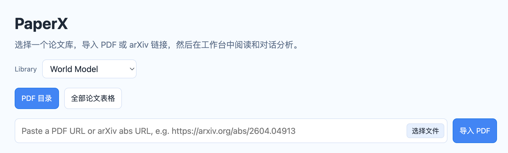

# PaperX

PaperX is a local paper reading workspace with PDF viewing, paper-aware chat, local notes, and PDF import.



## Quick Start

From a fresh checkout:

```bash
./install.sh
```

The installer will ask for runtime settings such as `OPENAI_BASE_URL`, `OPENAI_MODEL`, `OPENAI_API_KEY`, `HOST`, and `PORT` when no local `.env` file exists. After the server starts, open the URL printed by the installer. The port is controlled by `PORT` in `.env`; for server access, set `HOST=0.0.0.0` and open `http://<server-ip>:${PORT}`.

## Docs

- [Architecture](doc/architecture.md)
- [Deployment](doc/deployment.md)
- [Frontend notes](web/README.md)

## Data

PDF files and extracted assets are local-only and ignored by Git. The default library starts empty; `world-model-library` is available from the library selector.

## Contributing

PaperX is an evolving local research tool. Contributions, bug reports, workflow ideas, and maintenance help are welcome.
